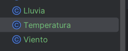

# EXAMEN FINAL

## Proyecto

Voy a desarrollar y probar un sistema que desencadena eventos avanzados basados en combinaciones complejas de condiciones booleanas externas relacionadas con el clima. Este sistema debe ser diseñado de manera limpia, siguiendo principios de diseño como responsabilidad única, código limpio y TDD.
El proyecto se desarrollará en dos sprints, donde se aplicarán técnicas de validación de pruebas,refactorización y contenerización utilizando Docker

# Entradas y salidas del sistema

**Entrada**
El sistema recibe un conjunto de condiciones climáticas externas como entrada. Estas condiciones pueden incluir:

- Temperatura (en grados Celsius)
- Cantidad de Lluvia (en mm)
- Velocidad del Viento (en km/h)
- Humedad (en porcentaje)
- Presión Atmosférica (en hPa)

Cada una de estas condiciones será evaluada para determinar si se cumplen ciertos criterios booleanos que desencadenan eventos específicos.
**Salida**
El sistema genera eventos basados en las combinaciones de las condiciones climáticas evaluadas. Las salidas pueden ser:

- Alertas (Alerta de Lluvia Intensa, Alerta de Viento Fuerte)
- Acciones automáticas (Activar Sistema de Riego, Cerrar Persianas)
- Notificaciones (Enviar Notificación a Usuarios)

Las salidas deben estar claramente definidas y documentadas en función de las combinaciones específicas de condiciones climáticas.

# Primer Sprint: Estrategia de validación de pruebas, stubs y fakes (8 puntos)

Objetivos
• Desarrollo inicial del sistema: Crear el sistema con un diseño limpio y clases con responsabilidad única.
• Implementación de TDD: Utilizar el desarrollo dirigido por pruebas (TDD) para asegurar que cada componente cumpla con su responsabilidad.
• Estrategia de validación de pruebas: Definir y aplicar una estrategia de validación que incluya stubs y fakes para simular las condiciones climáticas externas.
• Refactorización y código limpio: Asegurar que el código sea limpio y fácil de mantener mediante la refactorización continua.
• Métricas de calidad: Establecer métricas de calidad para evaluar la cobertura de pruebas y la complejidad del código.

## 1 Diseño y implementación inicial:
o Diseñar las clases responsables de manejar las condiciones climáticas (Temperatura, Lluvia, Viento).

Creamos las clases LLuvia,Temperatura,Viento : 



Por ahora el codigo de las clases estan asi :

Clase Viento: 

```java
package org.example;

public class Viento {
}
```

Clase Temperatura: 

```java
package org.example;

public class Temperatura {

}
```

Clase LLuvia : 

```java
package org.example;

public class Lluvia {

}

```

En el otro paso aplicaremos el enofque TDD para implementar los metodos en las clases mostradas.

## 2 Y3 Desarrollo con TDD:
o Escribir pruebas unitarias para cada clase antes de implementar la funcionalidad.(tambien hare uso de fakes con TDD)

Antes de realizar  la pruebas ejecutamos el comando , para limpiar el gradle : 

```java
.\gradlew clean
```


En la imagen anterior observamos que el gradle se ha ejecutado correctamente .Ahora procedemos a construir el gradlew con el siguiente comando : 

```java
.\gradlew build
```


En la imagen anterior observamos que el gradle se ha construido exitosamente.Una vez realizado esto procedemos a crear la pruebas unitarias.

**Primero** vamos a crear la clase `LluviaTest` donde implementaremos la prueba unitaria `testObtenerVolumen`  para corroborar que se obtenga correctamente el volumen(en mm)  de la lluvia.(**implementaremos el uso de fakes)**

Codigo de la prueba `testObtenerVolumen`

```java
package org.example;
import org.junit.jupiter.api.Test;
import org.junit.jupiter.api.BeforeEach;

import static org.junit.jupiter.api.Assertions.assertEquals;

public class LluviaTest {
    @Test
    public void testObtenerVolumen() {
        //fake para la clase CantidadLluvia
        ExternalVolumenService fakevolumen = new FakeExternalVolumenService();

        Lluvia volumenlluvia = new Lluvia(fakevolumen);
        double result = CantidadLluvia.getCurrentVolumen();

        assertEquals(10, result);
    }
}
```

El codigo muestra la creacion del fake para la clase `LluviaTest` que funcionara como una simulacion para esta .Con el assertEquals se compara los resultados del fake y el volumenlluvia.

A continuación vamos a correr la clase `LluviaTest` para verificar si la prueba testObtenerVolumen pasó, dando click al boton verde play:


Ejecutamos la prueba  : 


Observamos que la prueba no paso y esto se debe a que no existe las clases `ExternalVolumenService` ,`FakeExternalVolumenService`,el metodo `getCurrentVolumen()` y`assertEquals`.

A continuacion : implementaremos el minimo codigo para que la prueba pase exitosamente:

Creación de la clase `ExternalVolumenService` : 


Creación de la clase `FakeExternalVolumenService` : 


Implementacion del metodo `getCurrentVolumen` en la clase LLuvia en el cual por ahora retornara 10 para ver si la prueba es correcta : 


Importamos `Assertions.*assertEquals*;` ,finalmente nuestro codigo es el siguiente : 


Ejecutamos las pruebas y de nuevo tenemos problemas:


Nos menciona que volumenlluvia requiere de argumentos para ellos crearemos los constructores: 

en la clase LLuvia: 


Exxplicacion : 

- Crea un atributo privado externalVolumen de la clase ExternalVolumenService .
- Implementa el constructor
- Impleementamos el metodo para obtener el volumen de la lluvia

En la clase `ExternalVolumenService` : 


Explicacion : 

- Creamos el metood getVolumen para obtener el volumen en la ciudad que implementaremos el proyecto.(tiene como retono 0)

En la clase `FakeExternalVolumenService`  :


Explicacion : 

- Al hacer un @override  implementamos el metodo getvolumen de`ExternalVolumenService` hacemos que retorne 10 con el fin de hacer que la prueba pase correctamente.

Ahora ejecutamos `LluviaTetst` : 


De la imagen anterior  vemos que la prueba 
`testObtenerVolumen`paso correctamente .

**Análogamente** creamos los **fakes** para la clase Temperatura  y Viento  : 

Empecemos con la clase Temperatura: 

Crearemos la clase `TemperaturaTest` y dentro de ella implementaremos la prueba `testObtenerTemperatura`  para verificar la correcta obtencion de la temperatura : 

```java
package org.example;

import org.junit.jupiter.api.Test;

import static org.junit.jupiter.api.Assertions.*;
public class TemperaturaTest {
    @Test
    public void testObtenerTemperatura() {
        //fake para la clase Temperatura
        ExternalTemperaturaService faketemperatura = new FakeExternalTemperaturaService();
        //variable real para la clase temperatura
        Temperatura temperatura = new Temperatura(faketemperatura);
        double result = Temperatura.getCurrentTemperatura(); //obtiene la temperatura

        assertEquals(20, result);
    }
}

```

El codigo muestra la creacion del fake `ExternalTemperaturaService` para la clase `TemperaturaTest` que funcionara como una simulacion para esta .Con el assertEquals se compara los resultados del fake y el de la  temperatura.

A continuación vamos a correr la clase `TemperaturaTest` para verificar si la prueba testObtenerTemperatura pasó, dando click al boton verde play:


Ejecutamos la prueba  : 


La imagen nos muestra que hay 3 errores por lo que la prueba no pasó,en las cuales nos indica que no existe la calse `ExternalTemperaturaService` ,`FakeExternalTemperaturaService` ,y el metodo `getCurrentTemperatura`. 

Ahora implementaremos el minimo codigo para hacer que laprueba pase. 

Crearemos la clase `ExternalTemperaturaService` : 


Explicacion :  

- ExternalTemperaturaService se usara  como una dependencia en la clase`FakeExternalTemperaturaService` para obtener valores de temperatura.
- El metodo público  `getTemperatura`  devuelve un valor de tipo `double`. El método no toma ningún parámetro y por ahora devolvera un valor fijo de `0.0`.

Crearemos la clase`FakeExternalTemperaturaService` : 


Explicacion : 

- Declaramos que la clase `FakeExternalTemperaturaService` que extiende (hereda) de `ExternalTemperaturaService`. Esto significa que `FakeExternalTemperaturaService` es una subclase de `ExternalTemperaturaService`

Modificacion de la clase `Temperatura`  : 


Explicacion : 

- Crea un atributo privado `*externaltemperatura*` de la clase `ExternalTemperaturaService` .
- Implementa el constructor
- Impleementamos el metodo para obtener el volumen de la temperatura con `getCurrentTemperatura`

Ejecutamos la clase TemperaturaTest para verifcar el comportamientos de las pruebas: 


La prueba paso exitosamente lo cual indica que se obtiene correctamente la temperatura.

Finalmente hacemos el mismo proceso para la clase Viento.

Crearemos la clase `VientoTest` y dentro de ella implementaremos la prueba `testObtenerVelocidadViento`  para verificar la correcta obtencion de la temperatura : 

```java
package org.example;

import org.junit.jupiter.api.Test;

import static org.junit.jupiter.api.Assertions.*;

class VientoTest {
    @Test
    public void testObtenerVelocidadViento() {
        //fake para la clase viento
        ExternalVelocidadService fakevelocidad = new FakeExternalVelocidadService();

        Viento velocidadviento = new Viento(fakevelocidad);
        double result = Viento.getCurrentVelocidad();//obtiene la velocidad

        assertEquals(5, result);//compara la velocidad del viento
    }

}
```

El codigo muestra la creacion del fake `ExternalVelocidadService` para la clase `VientoTest` que funcionara como una simulacion para esta .Con el assertEquals se compara los resultados del fake y el de la  temperatura.

A continuación vamos a correr la clase `VientoTest` para verificar si la prueba testObtenerTemperatura pasó, dando click al boton verde play:


Ejecutamos la prueba  : 


La imagen nos muestra que hay 3 errores por lo que la prueba no pasó,en las cuales nos indica que no existe la calse ExternalVelocidadService ,FakeExternalVelocidadService ,y el metodo getCurrentVelocidad. 

Ahora implementaremos el minimo codigo para hacer que laprueba pase. 

Crearemos la clase ExternalVelocidadService : 


Explicacion :  

- ExternalVelocidadService se usara  como una dependencia en la clase FakeExternalVelocidadService para obtener valores de temperatura.
- El metodo público  `getVelocidad`  devuelve un valor de tipo `double`. El método no toma ningún parámetro y por ahora devolvera un valor fijo de `0.0`.

Crearemos la clase`FakeExternalVelocidadService` : 


Explicacion : 

- Declaramos que la clase `FakeExternalVelocidadService` que extiende (hereda) de `ExternalVelocidadService`. Esto significa que `FakeExternalVelocidadService` es una subclase de `ExternalVelocidadService`

Modificacion de la clase Viento  : 

Explicacion : 


- Crea un atributo privado `*externalviento*` de la clase `ExternalVientoService` .
- Implementa el constructor
- Impleementamos el metodo para obtener el volumen de la temperatura con `getCurrentViento`

Ejecutamos la clase VientoTest para verifcar el comportamientos de las pruebas: 


La prueba paso exitosamente lo cual indica que se obtiene correctamente la velocidad del viento