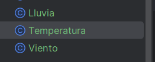

# EXAMEN FINAL

## Proyecto

Voy a desarrollar y probar un sistema que desencadena eventos avanzados basados en combinaciones complejas de condiciones booleanas externas relacionadas con el clima. Este sistema debe ser diseñado de manera limpia, siguiendo principios de diseño como responsabilidad única, código limpio y TDD.
El proyecto se desarrollará en dos sprints, donde se aplicarán técnicas de validación de pruebas,refactorización y contenerización utilizando Docker

# Entradas y salidas del sistema

**Entrada**
El sistema recibe un conjunto de condiciones climáticas externas como entrada. Estas condiciones pueden incluir:

- Temperatura (en grados Celsius)
- Cantidad de Lluvia (en mm)
- Velocidad del Viento (en km/h)
- Humedad (en porcentaje)
- Presión Atmosférica (en hPa)

Cada una de estas condiciones será evaluada para determinar si se cumplen ciertos criterios booleanos que desencadenan eventos específicos.
**Salida**
El sistema genera eventos basados en las combinaciones de las condiciones climáticas evaluadas. Las salidas pueden ser:

- Alertas (Alerta de Lluvia Intensa, Alerta de Viento Fuerte)
- Acciones automáticas (Activar Sistema de Riego, Cerrar Persianas)
- Notificaciones (Enviar Notificación a Usuarios)

Las salidas deben estar claramente definidas y documentadas en función de las combinaciones específicas de condiciones climáticas.

# Primer Sprint: Estrategia de validación de pruebas, stubs y fakes (8 puntos)

Objetivos
• Desarrollo inicial del sistema: Crear el sistema con un diseño limpio y clases con responsabilidad única.
• Implementación de TDD: Utilizar el desarrollo dirigido por pruebas (TDD) para asegurar que cada componente cumpla con su responsabilidad.
• Estrategia de validación de pruebas: Definir y aplicar una estrategia de validación que incluya stubs y fakes para simular las condiciones climáticas externas.
• Refactorización y código limpio: Asegurar que el código sea limpio y fácil de mantener mediante la refactorización continua.
• Métricas de calidad: Establecer métricas de calidad para evaluar la cobertura de pruebas y la complejidad del código.

## 1 Diseño y implementación inicial:
o Diseñar las clases responsables de manejar las condiciones climáticas (Temperatura, Lluvia, Viento).

Creamos las clases LLuvia,Temperatura,Viento : 



Por ahora el codigo de las clases estan asi :

Clase Viento: 

```java
package org.example;

public class Viento {
}
```

Clase Temperatura: 

```java
package org.example;

public class Temperatura {

}
```

Clase LLuvia : 

```java
package org.example;

public class Lluvia {

}

```

En el otro paso aplicaremos el enofque TDD para implementar los metodos en las clases mostradas.

## 2 Y3 Desarrollo con TDD:
o Escribir pruebas unitarias para cada clase antes de implementar la funcionalidad.(tambien hare uso de fakes con TDD)

Antes de realizar  la pruebas ejecutamos el comando , para limpiar el gradle : 

```java
.\gradlew clean
```


En la imagen anterior observamos que el gradle se ha ejecutado correctamente .Ahora procedemos a construir el gradlew con el siguiente comando : 

```java
.\gradlew build
```


En la imagen anterior observamos que el gradle se ha construido exitosamente.Una vez realizado esto procedemos a crear la pruebas unitarias.

**Primero** vamos a crear la clase `LluviaTest` donde implementaremos la prueba unitaria `testObtenerVolumen`  para corroborar que se obtenga correctamente el volumen(en mm)  de la lluvia.(**implementaremos el uso de fakes)**

Codigo de la prueba `testObtenerVolumen`

```java
package org.example;
import org.junit.jupiter.api.Test;
import org.junit.jupiter.api.BeforeEach;

import static org.junit.jupiter.api.Assertions.assertEquals;

public class LluviaTest {
    @Test
    public void testObtenerVolumen() {
        //fake para la clase CantidadLluvia
        ExternalVolumenService fakevolumen = new FakeExternalVolumenService();

        Lluvia volumenlluvia = new Lluvia(fakevolumen);
        double result = CantidadLluvia.getCurrentVolumen();

        assertEquals(10, result);
    }
}
```

El codigo muestra la creacion del fake para la clase `LluviaTest` que funcionara como una simulacion para esta .Con el assertEquals se compara los resultados del fake y el volumenlluvia.

A continuación vamos a correr la clase `LluviaTest` para verificar si la prueba testObtenerVolumen pasó, dando click al boton verde play:


Ejecutamos la prueba  : 


Observamos que la prueba no paso y esto se debe a que no existe las clases `ExternalVolumenService` ,`FakeExternalVolumenService`,el metodo `getCurrentVolumen()` y`assertEquals`.

A continuacion : implementaremos el minimo codigo para que la prueba pase exitosamente:

Creación de la clase `ExternalVolumenService` : 


Creación de la clase `FakeExternalVolumenService` : 


Implementacion del metodo `getCurrentVolumen` en la clase LLuvia en el cual por ahora retornara 10 para ver si la prueba es correcta : 


Importamos `Assertions.*assertEquals*;` ,finalmente nuestro codigo es el siguiente : 


Ejecutamos las pruebas y de nuevo tenemos problemas:


Nos menciona que volumenlluvia requiere de argumentos para ellos crearemos los constructores: 

en la clase LLuvia: 


Exxplicacion : 

- Crea un atributo privado externalVolumen de la clase ExternalVolumenService .
- Implementa el constructor
- Impleementamos el metodo para obtener el volumen de la lluvia

En la clase `ExternalVolumenService` : 


Explicacion : 

- Creamos el metood getVolumen para obtener el volumen en la ciudad que implementaremos el proyecto.(tiene como retono 0)

En la clase `FakeExternalVolumenService`  :


Explicacion : 

- Al hacer un @override  implementamos el metodo getvolumen de`ExternalVolumenService` hacemos que retorne 10 con el fin de hacer que la prueba pase correctamente.

Ahora ejecutamos `LluviaTetst` : 


De la imagen anterior  vemos que la prueba 
`testObtenerVolumen`paso correctamente .

**Análogamente** creamos los **fakes** para la clase Temperatura  y Viento  : 

Empecemos con la clase Temperatura: 

Crearemos la clase `TemperaturaTest` y dentro de ella implementaremos la prueba `testObtenerTemperatura`  para verificar la correcta obtencion de la temperatura : 

```java
package org.example;

import org.junit.jupiter.api.Test;

import static org.junit.jupiter.api.Assertions.*;
public class TemperaturaTest {
    @Test
    public void testObtenerTemperatura() {
        //fake para la clase Temperatura
        ExternalTemperaturaService faketemperatura = new FakeExternalTemperaturaService();
        //variable real para la clase temperatura
        Temperatura temperatura = new Temperatura(faketemperatura);
        double result = Temperatura.getCurrentTemperatura(); //obtiene la temperatura

        assertEquals(20, result);
    }
}

```

El codigo muestra la creacion del fake `ExternalTemperaturaService` para la clase `TemperaturaTest` que funcionara como una simulacion para esta .Con el assertEquals se compara los resultados del fake y el de la  temperatura.

A continuación vamos a correr la clase `TemperaturaTest` para verificar si la prueba testObtenerTemperatura pasó, dando click al boton verde play:


Ejecutamos la prueba  : 


La imagen nos muestra que hay 3 errores por lo que la prueba no pasó,en las cuales nos indica que no existe la calse `ExternalTemperaturaService` ,`FakeExternalTemperaturaService` ,y el metodo `getCurrentTemperatura`. 

Ahora implementaremos el minimo codigo para hacer que laprueba pase. 

Crearemos la clase `ExternalTemperaturaService` : 


Explicacion :  

- ExternalTemperaturaService se usara  como una dependencia en la clase`FakeExternalTemperaturaService` para obtener valores de temperatura.
- El metodo público  `getTemperatura`  devuelve un valor de tipo `double`. El método no toma ningún parámetro y por ahora devolvera un valor fijo de `0.0`.

Crearemos la clase`FakeExternalTemperaturaService` : 


Explicacion : 

- Declaramos que la clase `FakeExternalTemperaturaService` que extiende (hereda) de `ExternalTemperaturaService`. Esto significa que `FakeExternalTemperaturaService` es una subclase de `ExternalTemperaturaService`

Modificacion de la clase `Temperatura`  : 


Explicacion : 

- Crea un atributo privado `*externaltemperatura*` de la clase `ExternalTemperaturaService` .
- Implementa el constructor
- Impleementamos el metodo para obtener el volumen de la temperatura con `getCurrentTemperatura`

Ejecutamos la clase TemperaturaTest para verifcar el comportamientos de las pruebas: 


La prueba paso exitosamente lo cual indica que se obtiene correctamente la temperatura.

Finalmente hacemos el mismo proceso para la clase Viento.

Crearemos la clase `VientoTest` y dentro de ella implementaremos la prueba `testObtenerVelocidadViento`  para verificar la correcta obtencion de la temperatura : 

```java
package org.example;

import org.junit.jupiter.api.Test;

import static org.junit.jupiter.api.Assertions.*;

class VientoTest {
    @Test
    public void testObtenerVelocidadViento() {
        //fake para la clase viento
        ExternalVelocidadService fakevelocidad = new FakeExternalVelocidadService();

        Viento velocidadviento = new Viento(fakevelocidad);
        double result = Viento.getCurrentVelocidad();//obtiene la velocidad

        assertEquals(5, result);//compara la velocidad del viento
    }

}
```

El codigo muestra la creacion del fake `ExternalVelocidadService` para la clase `VientoTest` que funcionara como una simulacion para esta .Con el assertEquals se compara los resultados del fake y el de la  temperatura.

A continuación vamos a correr la clase `VientoTest` para verificar si la prueba testObtenerTemperatura pasó, dando click al boton verde play:


Ejecutamos la prueba  : 


La imagen nos muestra que hay 3 errores por lo que la prueba no pasó,en las cuales nos indica que no existe la calse ExternalVelocidadService ,FakeExternalVelocidadService ,y el metodo getCurrentVelocidad. 

Ahora implementaremos el minimo codigo para hacer que laprueba pase. 

Crearemos la clase ExternalVelocidadService : 


Explicacion :  

- ExternalVelocidadService se usara  como una dependencia en la clase FakeExternalVelocidadService para obtener valores de temperatura.
- El metodo público  `getVelocidad`  devuelve un valor de tipo `double`. El método no toma ningún parámetro y por ahora devolvera un valor fijo de `0.0`.

Crearemos la clase`FakeExternalVelocidadService` : 


Explicacion : 

- Declaramos que la clase `FakeExternalVelocidadService` que extiende (hereda) de `ExternalVelocidadService`. Esto significa que `FakeExternalVelocidadService` es una subclase de `ExternalVelocidadService`

Modificacion de la clase Viento  : 

Explicacion : 


- Crea un atributo privado `*externalviento*` de la clase `ExternalVientoService` .
- Implementa el constructor
- Impleementamos el metodo para obtener el volumen de la temperatura con `getCurrentViento`

Ejecutamos la clase VientoTest para verifcar el comportamientos de las pruebas: 


La prueba paso exitosamente lo cual indica que se obtiene correctamente la velocidad del viento

# 3. Validación de pruebas con stubs y fakes:

Vamos a crear una clase `Clima` que contenga las condiciones climáticas y métodos para evaluar las condiciones climáticas evaluadas. También definiremos los criterios booleanos que desencadenan eventos específicos.

```java
package org.example;

public class Clima {
    private Temperatura temperatura; // temperatura actual
    private Lluvia lluvia; // lluvia actual
    private Viento viento; //viento actual

    // Constructor de los campos de temperatura, lluvia y viento
    public Clima(Temperatura temperatura, Lluvia lluvia, Viento viento) {
        this.temperatura = temperatura;
        this.lluvia = lluvia;
        this.viento = viento;
    }

    // Método que evalúa las condiciones climáticas y genera alertas según ciertas condiciiones
    public String evaluarCondiciones() {
        StringBuilder eventos = new StringBuilder();

        // Generar alerta si el volumen de lluvia es mayor a 50
        if (lluvia.getCurrentVolumen() > 50) {
            eventos.append("Alerta de Lluvia Intensa\n");
        }

        // Generar alerta si la velocidad del viento es mayor a 80
        if (viento.getCurrentVelocidad() > 80) {
            eventos.append("Alerta de Viento Fuerte\n");
        }

        // Generar alerta si la temperatura es mayor a 30
        if (temperatura.getCurrentTemperatura() > 30) {
            eventos.append("Activar Sistema de Riego\n");
        }

        // Si no se generaron alertas, indicar que no se requieren acciones
        if (eventos.length() == 0) {
            eventos.append("No se requieren acciones\n");
        }

        return eventos.toString(); // Devolver las alertas generadas en formato de cadena
    }
}

```

Nota: el codigo esta comentado con el fin de explicar el proque se implemento cada metodo.

### Ahora creamos los stubs para simular las condiciones climáticas , con el fin de evaluar las condiciones climaticas  :

Haremos unas modificaciones en las clases para poder hacer uso de stubs: 

En las clases `Temperatura`,`Viento` y `lluvia` añadiremos los constructores independientes de las clases externas :ExternalTemperaturaService,ExternalVolumenService,ExternalVelocidadService: 

**Clase temperatura :** 

Añadimos los  nuevos constructores y en el método `getCurrentTemperatura` implementamos una condiciional que retorna un atributo fake (`externaltemperatura`)cuando trabajemos con pruebas que usen fakes, en otro caso(caso real) retorna la variable temperatura.

```java
package org.example;

public class Temperatura {
    private static double temperatura; // valor de la temperatura

    //Nuevo Constructor de la clase Temperatura
    public Temperatura(double temperatura) {
        this.temperatura = temperatura;
    }
    private static ExternalTemperaturaService externaltemperatura; //atributo de la clase CantidadLluvia
    //constructor de la clase Temperatura usando la clas ExternalTemperaturaService
    public Temperatura(ExternalTemperaturaService externaltemperatura) {

        this.externaltemperatura = externaltemperatura;
    }
    //metodo para obtener la temperatura en celsius
    public static double getCurrentTemperatura() {
        if(externaltemperatura != null){ // si el atributo es de clase fake
            return externaltemperatura.getTemperatura(); }
        else { // si el atributo es de clase real
            return temperatura;
        }

    }
}

```

**Clase Viento :** 

Añadimos los  nuevos constructores y en el método `getCurrentVelocidad` implementamos una condiciional que retorna un atributo fake (`externalvelocidad`)cuando trabajemos con pruebas que usen fakes, en otro caso(caso real) retorna la variable velocidad.

```java
package org.example;

public class Viento {
    private static double velocidad; // valor de la velocidad del viento
    // Nuevo constructor de la clase Viento
    public Viento(double velocidad) {
        this.velocidad = velocidad;
    }
    private static ExternalVelocidadService externalvelocidad;
    //atributo de la clase viento
    //constructor de la clase viento
    public Viento(ExternalVelocidadService externalvelocidad) {

        this.externalvelocidad = externalvelocidad;
    }
    //metodo para obtener la velocidad del viento
    public static double getCurrentVelocidad() {
        return externalvelocidad.getVelocidad();
    }
}

```

**Clase Lluvia :** 

Añadimos los  nuevos constructores 

```java
package org.example;

public class Lluvia {
    private static double volumen; // valor del volumen de lluvia

    //Nuevo Constructor de la clase Lluvia
    public Lluvia(double volumen) {
        this.volumen = volumen;
    }

     private static ExternalVolumenService externalvolumen; //atributo de la clase CantidadLluvia
    //constructor fake de la clase Lluvia
        public Lluvia(ExternalVolumenService externalvolumen) {
            this.externalvolumen = externalvolumen;
        }
    //metodo para obtener el volumen de la lluvia
        public static double getCurrentVolumen() {
            return externalvolumen.getVolumen();
        }
}

```

Creamos la clase `ClimaTest` y dentro de ella implementare 3 metodos que tiene como funcion comparar la salida y verificar que dado los parametros ingresados sean casos de alerta o de activar sistema

```java
package org.example;

import org.junit.jupiter.api.Test;

import static org.junit.jupiter.api.Assertions.*;

public class ClimaTest {

    @Test
    public void testEvaluarCondicionesLluviaIntensa() {
        // Crear instancias de condiciones climáticas simuladas
        Temperatura temperatura0 = new Temperatura(20.0); // temperatura normal
        Lluvia lluvia0 = new Lluvia(60.0); // volumen alto de lluvia para simular lluvia intensa
        Viento viento0 = new Viento(10.0); // velocidad normal de viento

        // Crear instancia de la clase Clima
        Clima clima = new Clima(temperatura0, lluvia0, viento0);

        // Evaluar condiciones
        String result = clima.evaluarCondiciones();

        // Verificar resultados esperados
        assertEquals("Alerta de Lluvia Intensa\n", result);
    }

    @Test
    public void testEvaluarCondicionesVientoFuerte() {
        // Crear instancias de condiciones climáticas simuladas
        Temperatura temperatura1 = new Temperatura(20.0); // temperatura normal
        Lluvia lluvia1 = new Lluvia(10.0); // volumen normal de lluvia
        Viento viento1= new Viento(90.0); // velocidad alta de viento para simular viento fuerte

        // Crear instancia de la clase Clima
        Clima clima = new Clima(temperatura1, lluvia1, viento1);

        // Evaluar condiciones
        String result = clima.evaluarCondiciones();

        // Verificar resultados esperados
        assertEquals("Alerta de Viento Fuerte\n", result);
    }

    @Test
    public void testEvaluarCondicionesSistemaRiego() {
        // Crear instancias de condiciones climáticas simuladas
        Temperatura temperatura2 = new Temperatura(35.0); // temperatura alta para activar sistema de riego
        Lluvia lluvia2 = new Lluvia(10.0); // volumen normal de lluvia
        Viento viento2 = new Viento(10.0); // velocidad normal de viento

        // Crear instancia de la clase Clima
        Clima clima = new Clima(temperatura2, lluvia2, viento2);

        // Evaluar condiciones
        String result = clima.evaluarCondiciones();

        // Verificar resultados esperados
        assertEquals("Activar Sistema de Riego\n", result);
    }

}

```

### Test: `testEvaluarCondicionesLluviaIntensa`

- **Instanciar condiciones climáticas simuladas**:
    - `Temperatura temperatura0 = new Temperatura(20.0);`: Se crea una temperatura normal (20°C).
    - `Lluvia lluvia0 = new Lluvia(60.0);`: Se crea un alto volumen de lluvia (60 mm) para simular lluvia intensa.
    - `Viento viento0 = new Viento(10.0);`: Se crea una velocidad normal de viento (10 km/h).
- **Creación de la instancia de `Clima`**:
    - `Clima clima = new Clima(temperatura0, lluvia0, viento0);`: Se crea una instancia de la clase `Clima` con las condiciones climáticas simuladas.
- **Evaluación de condiciones**:
    - `String result = clima.evaluarCondiciones();`: Metodoo para evaluar  las condiciones climáticas.
- **Verificación de resultados esperados**:
    - `assertEquals("Alerta de Lluvia Intensa\\n", result);`:Aqui se corrobora que el resultado sea una alerta de lluvia intensa.

### Test: `testEvaluarCondicionesVientoFuerte`

- **Creación de instancias de condiciones climáticas simuladas**:
    - `Temperatura temperatura1 = new Temperatura(20.0);`: Temperatura normal (20°C).
    - `Lluvia lluvia1 = new Lluvia(10.0);`: Volumen normal de lluvia (10 mm).
    - `Viento viento1= new Viento(90.0);`: Alta velocidad de viento (90 km/h) para simular viento fuerte.
- **Creación de la instancia de `Clima`**:
    - `Clima clima = new Clima(temperatura1, lluvia1, viento1);`: Se crea una instancia de la clase `Clima` con las condiciones climáticas simuladas.
- **Evaluación de condiciones**:
    - `String result = clima.evaluarCondiciones();`: Se evalua las condiciones climáticas.
- **Verificación de resultados esperados**:
    - `assertEquals("Alerta de Viento Fuerte\\n", result);`:Verifica que el resultado sea una alerta de viento fuerte.

### Test: `testEvaluarCondicionesSistemaRiego`

- **Creación de instancias de condiciones climáticas simuladas**:
    - `Temperatura temperatura2 = new Temperatura(35.0);`: Temperatura alta (35°C) para activar el sistema de riego.
    - `Lluvia lluvia2 = new Lluvia(10.0);`: Volumen normal de lluvia (10 mm).
    - `Viento viento2 = new Viento(10.0);`: Velocidad normal de viento (10 km/h).
- **Creación de la instancia de `Clima`**:
    - `Clima clima = new Clima(temperatura2, lluvia2, viento2);`: Se crea una instancia de la clase `Clima` con las condiciones climáticas simuladas.
- **Evaluación de condiciones**:
    - `String result = clima.evaluarCondiciones();`: Se evalua las condiciones climáticas.
- **Verificación de resultados esperados**:
    - `assertEquals("Activar Sistema de Riego\\n", result);`: Se verifica que el resultado sea la activación del sistema de riego.

Para terminar con lo aasiginado en stubs ejecutamos todas las pruebas en simultaneo de la clase `ClimaTest` , para ello presionamos el boton verde acontinuacion : 


Nos da como salida: 


Explicacion : El mensaje indica que el proceso de compilación de las pruebas unitarias de `ClimaTest`y ejecución de pruebas fue exitoso. 

# Refactorización y código limpio:

## o Refactorizar el código regularmente para mejorar la legibilidad y mantenibilidad.

Para el proceso de refactoriazacion usaremos **Sonarquebe**.

Primero vamos al [http://localhost:9000/](http://localhost:9000/projects/create?mode=manual) y creamos un nuevo proyecto y llenamos los siguientes campos , nuestro nombre del proyecto es **FINALEXAMEN**:


En la imagen izaquierda generamos un nuevo token que no tiene fecha de expiración. En la imagen de recha nos muestra el token generado que lo guardaremos para futurs ocasiones : 


 token : **sqp_f2d263d53b3486c802aafeb3a4439ec35983e355**

Ahora nos dirigimos a nuestro archivo `build.gradle`  e implementamos lo suiguiente: 

Añadimos el plugin de sonarquebe : 

`id "org.sonarqube" version "3.5.0.2730"`


Añadimos el siguiente codigo de sonar donde especificamos el nombre del proyecto que queremos analizar(FINALEXAM) y el login que sera el hash que nos dieron al crear el proyecto : 


Ahora el nuestro [localhost](http://localhost) vemos que hay 34 olores de codigo .


Veamo cuales son los olores de codigo que debemos refactorizar: 


Como vemos en la imagen uno de estos problemas de mayor relevancia son : 

- Cambiar la referencia de instancia en Lluvia y Viento a una referencia estática.
- Eliminar asignación de "temperatura externa".

**Refactorizemos y resolvamos en en el mismo Sonarquebe:** 

Por ejmplo en la clase LLuvuia referenciamos nuevamentes los constructores: 

```java
package org.example;

public class Lluvia {
    private static double volumen; // valor del volumen de lluvia

    //Nuevo Constructor de la clase Lluvia
     Lluvia(double volumen) {
        Lluvia.volumen = volumen;
    }

     private static ExternalVolumenService externalvolumen; //atributo de la clase CantidadLluvia
    //constructor fake de la clase Lluvia
         Lluvia(ExternalVolumenService externalvolumen) { //referenciando
            Lluvia.externalvolumen = externalvolumen;
        }
    //metodo para obtener el volumen de la lluvia
        public static double getCurrentVolumen() {
            if(externalvolumen != null){ // si el atributo es de clase fake
                return externalvolumen.getVolumen(); }
            else { // si el atributo es de clase real
                return volumen;
            }

        }
}

```


Vemos que se han reducido los olores de codigo , el color verde significa que el codigo es adecuado.

## Aplicar principios de diseño limpio y patrones de diseño adecuados. :

En el proyecto de ClimaProject uso **Patrón Strategy** como patron de diseño para gestionar la obtención de datos climáticos. Cada tipo de dato climático (temperatura, velocidad del viento, volumen de lluvia) tiene una clase asignada (`Temperatura`, `Viento`, `Lluvia`) que puede usar diferentes estrategias (servicios reales o falsos) para obtener los datos. Las estrategias están representadas por  las clases  `External--Service` y `FakeExternal--Service`, permitiendo cambiar fácilmente entre ellas sin modificar la lógica principal del programa. Esto proporciona flexibilidad y facilita las pruebas al permitir el intercambio de implementaciones concretas según sea necesario.

# Métricas de calidad:

Primero añadimos nuestro build.gradle añadimos lo siguiente: 

**El plugin de jacoco:** 

```java
plugins {
    id 'java'
    id 'jacoco' // añadimos Plugin de JaCoCo
    id 'info.solidsoft.pitest' version '1.15.0'
    id "org.sonarqube" version "3.5.0.2730"
}
```

**Configuramos el Informe de Cobertura de Pruebas:** 

```java
// jacoco
jacoco {
    toolVersion = "0.8.12" // Versión de JaCoCo (compatible con java 21)
}

jacocoTestReport {
    dependsOn test // Ejecuta las pruebas antes de generar el informe
    reports {
        xml.required = true  // Update with required
        csv.required = true
        html.required = true
    }
}
```

Ahora corremos jacoco y tenemos el siguiente reporte :


## Clases

1. **Clima**:
    - **Coverage(cobertura de codigo)** : 92% de las instrucciones
    - **Missed Instructions**: 6 instrucciones no cubiertas.
    - **Missed Branches**: 87% de las ramas. 1 rama no cubierta.
    - **Cyclomatic Complexity**: 6.
2. **ExternalVolumenService**:
    - **Coverage**: 60% de las instrucciones.
    - **Missed Instructions**: 1 instrucción no cubierta.
    - **Cyclomatic Complexity**: 1.
3. **ExternalVelocidadService**:
    - **Coverage**: 60% de las instrucciones.
    - **Missed Instructions**: 1 instrucción no cubierta.
    - **Cyclomatic Complexity**: 1.
4. **ExternalTemperaturaService**:
    - **Coverage**: n/a (no hay datos de cobertura).
5. **Temperatura**:
    - **Coverage**: 100% de las instrucciones y ramas.
    - **Cyclomatic Complexity**: 4.
6. **Viento**:
    - **Coverage**: 100% de las instrucciones y ramas.
    - **Cyclomatic Complexity**: 4.
7. **Lluvia**:
    - **Coverage**: 100% de las instrucciones y ramas.
    - **Cyclomatic Complexity**: 4.
8. **FakeExternalVolumenService**:
    - **Coverage**: 100% de las instrucciones.
    - **Cyclomatic Complexity**: 2.
9. **FakeExternalVelocidadService**:
    - **Coverage**: 100% de las instrucciones.
    - **Cyclomatic Complexity**: 2.
10. **FakeExternalTemperaturaService**:
    - **Coverage**: 100% de las instrucciones.
    - **Cyclomatic Complexity**: 2.

### En total como proyecto

- **Total**:
    - **Instructions**: 92% cubiertas (10 de 139 no cubiertas).
    - **Branches**: 92% cubiertas (1 de 14 no cubiertas).
    - **Cyclomatic Complexity**: 30.
    - **Lines**: 54 líneas de código (4 no cubiertas).
    - **Methods**: 23 métodos (3 no cubiertos).
    - **Classes**: 10 clases (0 no cubiertas).

## Evaluamos la complejidad ciclomatica con Sonarquebe.


**Explicacion :** 

**Clima.java - Complejidad: 6**

- La clase `Clima` tiene una complejidad ciclomática de 6, lo que sugiere que contiene varios caminos de ejecución independientes.

**Lluvia.java, Temperatura.java, Viento.java - Complejidad: 4**

- Estas clases tienen una complejidad ciclomática de 4, lo cual es acepatable pues estas clases  contienen lógica de negocio básica para manejar las condiciones climáticas.

El proyecto en general tiene una complejidad de 24 lo que indica que hay una cantidad signfiicativas de decisiones condicionales y caminos de ejecución independientes.

# Ejecucion del programa

Para finalizar el sprint 1 agregamos el método main donde se ejecutara el programa en la clase `Clima` : 

```java
package org.example;

import java.util.Scanner;

public class Clima {
    private Temperatura temperatura; // temperatura actual
    private Lluvia lluvia; // lluvia actual
    private Viento viento; //viento actual

    // Constructor de los campos de temperatura, lluvia y viento
    public Clima(Temperatura temperatura, Lluvia lluvia, Viento viento) {
        this.temperatura = temperatura;
        this.lluvia = lluvia;
        this.viento = viento;
    }

    // Método que evalúa las condiciones climáticas y genera alertas según ciertas condiciiones
    public String evaluarCondiciones() {
        StringBuilder eventos = new StringBuilder();

        // Generar alerta si el volumen de lluvia es mayor a 50
        if (Lluvia.getCurrentVolumen() > 50) {
            eventos.append("Alerta de Lluvia Intensa\n");
        }

        // Generar alerta si la velocidad del viento es mayor a 80
        if (Viento.getCurrentVelocidad() > 80) {
            eventos.append("Alerta de Viento Fuerte\n");
        }

        // Generar alerta si la temperatura es mayor a 30
        if (Temperatura.getCurrentTemperatura() > 30) {
            eventos.append("Activar Sistema de Riego\n");
        }

        // Si no se generaron alertas, indicar que no se requieren acciones
        if (eventos.length() == 0) {
            eventos.append("No se requieren acciones\n");
        }

        return eventos.toString(); // Devolver las alertas generadas en formato de cadena
    }
    // Método principal para ejecutar el programa
    public static void main(String[] args) {
        Scanner scanner = new Scanner(System.in);

        // Solicitar datos al usuario
        System.out.print("Ingrese la temperatura (°C): ");
        double temperaturaValor = scanner.nextDouble();

        System.out.print("Ingrese el volumen de lluvia (mm): ");
        double lluviaValor = scanner.nextDouble();

        System.out.print("Ingrese la velocidad del viento (km/h): ");
        double vientoValor = scanner.nextDouble();

        // Crear instancias de Temperatura, Lluvia y Viento con los valores ingresados
        Temperatura temperatura = new Temperatura(temperaturaValor);
        Lluvia lluvia = new Lluvia(lluviaValor);
        Viento viento = new Viento(vientoValor);

        // Crear una instancia de Clima
        Clima clima = new Clima(temperatura, lluvia, viento);

        // Evaluar las condiciones y generar el reporte
        String reporte = clima.evaluarCondiciones();

        // Mostrar el reporte
        System.out.println("\nReporte de Condiciones Climáticas:");
        System.out.println(reporte);
    }
}
```

En el main se instanciara la variable scanner de la clase Scanner para que el programa pueda leer los datos de la temperatura , lluvia y velocidad del viento ingresadas por el usuario.Ejecutamos el programa : 


Vemos que al ingresar una temperatura de 25 , 2mm de lluvia y 10km/h en la velocidad del tiempo ,el reporte del programa nos inidica que no se requieren acciones.