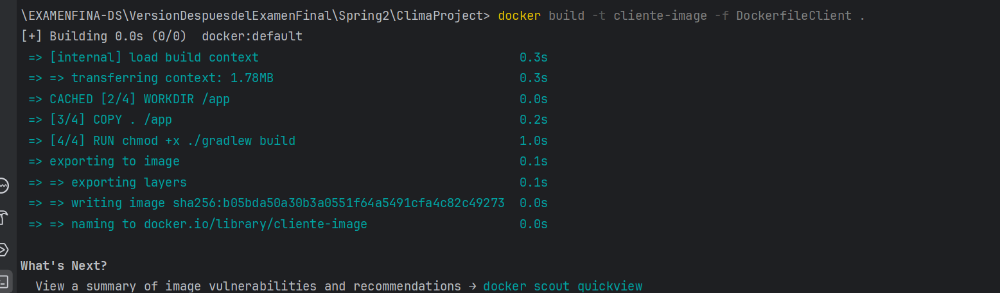

# Spring2:Uso de docker y mejora de la estrategia de pruebas

## **Objetivos**

• Contenerización del sistema: Utilizar Docker para contenerizar la aplicación y asegurar su
portabilidad.
• Refinamiento del tDD: Continuar utilizando TDD para cualquier nueva funcionalidad o
mejora.
• Mejora de la estrategia de pruebas: Integrar la estrategia de pruebas en un entorno
Dockerizado.
• Refactorización y código limpio: Continuar refactorizando el código para mantener su
calidad.
• Métricas de calidad: Continuar monitoreando y mejorando las métricas de calidad del
código.

### Actividades

### 1. Contenerización del Sistema

A continuacion crearemos un contenedor Docker para la aplicación y configurar múltiples servicios si es necesario.

**Pasos**:

1. **Crear un Dockerfile**:
    - Definimos las instrucciones para construir la imagen Docker en la aplicacion ClimaProject.
    
    ```
    # Utilizamos una imagen base con OpenJDK 17 (version que uso para el proyecto)
    FROM openjdk:17
    
    # Crea y cambia el directorio /app
    WORKDIR /app
    
    # Copia todos los archivos del directorio actual al directorio de trabajo en el contenedor
    COPY . /app
    
    # Compila el archivo WaveService.java
    RUN chmod +x ./gradlew build
    
    # Define el comando predeterminado para ejecutar el servicio
    CMD ["java","-cp","src/main/java/org/example" ,"Clima"]
    ```
    
    Abrimos el terminal y nos dirgimos donde esta nuestro projecto ejectuamos el  siguiente comando :
    
    ```java
    docker build -t <nombre-de-la-imagen> -f <nombre-Dockerfile> .
    ```
    
    ```java
    docker build -t cliente-image -f Dockerfile .
    
    ```
    
    
    
    Explicación : La imagen se construyo exitosamente adicionalmente se le creo su identificador unico en formato hash.
    
2. Configuramos el archivo **`docker-compose.yml`** para simular los servicios las basees de datos : 
    
    ```yaml
    version: '3.8'  # Versión de Docker Compose que se está utilizando
    
    services:  # Definición de los servicios que componen la aplicación
      app:  # Servicio de la aplicación principal
        build: .  # Construye la imagen Docker utilizando el Dockerfile en el directorio actual
        ports:  # Mapea los puertos del contenedor a los puertos de la máquina host
          - "8080:8080"  # Mapea el puerto 8080 del contenedor al puerto 8080 de la máquina host
        depends_on:  # Especifica las dependencias de este servicio
          - database  # Este servicio depende del servicio "database"
    
      database:  # Servicio de la base de datos
        image: postgres:latest  # Utiliza la imagen más reciente de PostgreSQL
        environment:  # Variables de entorno para configurar la base de datos
          POSTGRES_DB: mydb  # Nombre de la base de datos
          POSTGRES_USER: user  # Usuario de la base de datos
          POSTGRES_PASSWORD: password  # Contraseña del usuario de la base de datos
        ports:  # Mapea los puertos del contenedor a los puertos de la máquina host
          - "5432:5432"  # Mapea el puerto 5432 del contenedor al puerto 5432 de la máquina host
    
    ```
    
    El código proporcionado es un archivo `docker-compose.yml`, que se utiliza para definir y ejecutar aplicaciones multi-contenedor en Docker. A continuación se explica cada sección:
    
    ```yaml
    version: '3.8'  # Versión de Docker Compose que se está utilizando
    ```
    
    Esta línea especifica la versión de Docker Compose que se está utilizando, en este caso, la versión 3.8.
    
    ```yaml
    services:  # Definición de los servicios que componen la aplicación
    
    ```
    
    Esta sección define los diferentes servicios que componen la aplicación. En este caso, hay dos servicios: `app` y `database`.
    
    ```yaml
      app:  # Servicio de la aplicación principal
        build: .  # Construye la imagen Docker utilizando el Dockerfile en el directorio actual
        ports:  # Mapea los puertos del contenedor a los puertos de la máquina host
          - "8080:8080"  # Mapea el puerto 8080 del contenedor al puerto 8080 de la máquina host
        depends_on:  # Especifica las dependencias de este servicio
          - database  # Este servicio depende del servicio "database"
    
    ```
    
    - `app`: Define el servicio principal de la aplicación.
        - `build: .`: Construye la imagen Docker utilizando el Dockerfile en el directorio actual.
        - `ports`: Mapea los puertos del contenedor a los puertos de la máquina host. Aquí, el puerto 8080 del contenedor se mapea al puerto 8080 de la máquina host.
        - `depends_on`: Especifica que este servicio depende del servicio `database`, asegurando que el servicio de base de datos se inicie antes que la aplicación principal.
    
    ```yaml
      database:  # Servicio de la base de datos
        image: postgres:latest  # Utiliza la imagen más reciente de PostgreSQL
        environment:  # Variables de entorno para configurar la base de datos
          POSTGRES_DB: mydb  # Nombre de la base de datos
          POSTGRES_USER: user  # Usuario de la base de datos
          POSTGRES_PASSWORD: password  # Contraseña del usuario de la base de datos
        ports:  # Mapea los puertos del contenedor a los puertos de la máquina host
          - "5432:5432"  # Mapea el puerto 5432 del contenedor al puerto 5432 de la máquina host
    
    ```
    
    - `database`: Define el servicio de la base de datos.
        - `image: postgres:latest`: Utiliza la imagen más reciente de PostgreSQL.
        - `environment`: Define varias variables de entorno para configurar la base de datos:
            - `POSTGRES_DB`: Nombre de la base de datos (mydb).
            - `POSTGRES_USER`: Usuario de la base de datos (user).
            - `POSTGRES_PASSWORD`: Contraseña del usuario de la base de datos (password).
        - `ports`: Mapea los puertos del contenedor a los puertos de la máquina host. Aquí, el puerto 5432 del contenedor se mapea al puerto 5432 de la máquina host.
    
    Este archivo `docker-compose.yml` configura y ejecuta dos servicios: una aplicación principal y una base de datos PostgreSQL, asegurando que la base de datos se inicie antes de la aplicación y que ambos servicios estén disponibles en los puertos especificados.
    
    Con el siugiente comando ejecutamos para desplegar el contenedor: 
    
    ```java
    dokcer-compose up -d
    ```
    
    
    
    Explicacion : La imagen se desplego correctamente. 
    
    Como se puede ver en la siguiente imagen , la imagen cliente-image se creo correctamente , esto se puede ver al listar las imagenes con el comando  `docker image`  : 
    
    